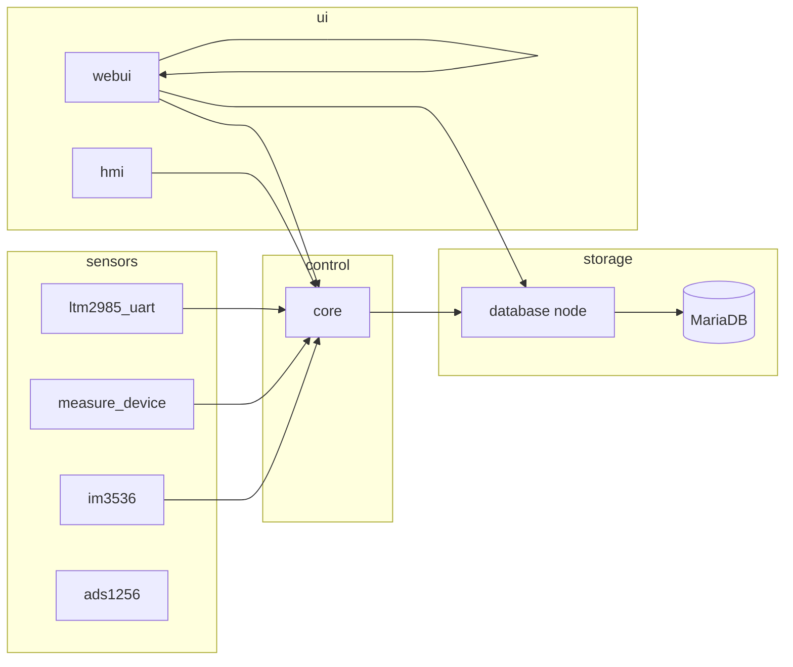

# Architecture

## High-level data flow

## Responsibility split

| Component | Owns |
|-----------|------|
| **core** | Program state machine, PI setpoints, PWM, per-sample control loop, `program_runs` lifecycle, publishing `/core/experiment/status` |
| **database** | SQL schema, transactions, JSON query API |
| **webui** | HTTP pages, WebSockets, program CRUD, export ZIP, configuration forms — **no** local program scheduler |
| **hmi** | Nextion pages, start/stop buttons, mirrors core status |
| **ltm2985_uart** | Temperature stream used as **control channel** for PI and program ticks |

## Control loop timing

- **`default` mode** — Program steps and PI updates run on each **control-channel temperature sample** (LTM today).
- **`measure_only` / `measure_ltm`** — Logging and program duration use a **timer** (`measurement_log_interval_sec`); no PI or ramp targets.

Core subscribes to one impedance topic (`/e720` or `/im3536`) based on `measure_source`.

## ROS namespaces

Core is typically launched with `__ns:=/core`, so services and topics are prefixed:

- Service: `/core/query` (JSON commands)
- Status: `/core/experiment/status` (`std_msgs/String` JSON)

The webui node subscribes to `/core/experiment/status` and forwards snapshots to the browser.

## Experiment status JSON (conceptual)

Published status includes fields such as:

- `program` — active program id, step, running flag, `experiment_mode`
- `temperature_control` — PI state, manual target, PWM
- `ltm_summary` — last LTM reading summary for dashboards

Web UI merges snapshots with local DB reads; it does not duplicate program timing logic.

## Threading and safety

- `ProgramExperimentManager` uses an `RLock` around start/stop/tick.
- Database elapsed-time anchors use a lock in `db_control.py`.
- FastAPI handlers call blocking ROS/DB work via `asyncio.to_thread` so the event loop stays responsive.

## Authentication

When enabled, the Web UI uses HTTP Basic auth (except `/static/`, `/ws/`, `/api/`, and `/dashboard/snapshot`). Documentation pages require the same credentials as other pages.
