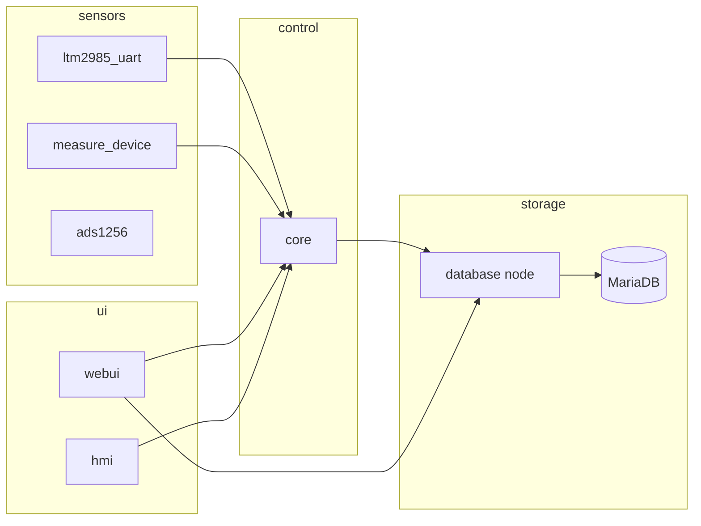

# Архітектура

## Потік даних (загалом)

## Розподіл відповідальності

| Компонент | Відповідає за |
|-----------|----------------|
| **core** | Стан програми, PI, PWM, цикл керування на зразок, `program_runs`, публікація `/core/experiment/status` |
| **database** | SQL-схема, транзакції, JSON API |
| **webui** | HTTP, WebSocket, CRUD програм, експорт — **без** локального планувальника |
| **hmi** | Сторінки Nextion, кнопки старт/стоп, синхронізація з core |
| **ltm2985_uart** | Потік температури — **канал керування** для PI і кроків програми |

## Час циклу керування

**Немає фіксованого таймера 1 Гц.** Кроки програми та оновлення PI виконуються на кожному **зразку температури каналу керування** (зараз LTM).

## Простори імен ROS

Core зазвичай з `__ns:=/core`:

- Сервіс: `/core/query`
- Статус: `/core/experiment/status` (`std_msgs/String`, JSON)

Вузол webui підписується на `/core/experiment/status`.

## JSON статусу (концептуально)

- `program` — id, крок, прапорець виконання
- `temperature_control` — PI, ручна ціль, PWM
- `ltm_summary` — короткий зріз LTM для панелей

Веб-UI об’єднує знімки зі зчитуванням БД; логіку таймінгу програм не дублює.

## Потоки та безпека

- `ProgramExperimentManager` — `RLock` навколо start/stop/tick.
- Якорі `elapsed_s` у БД захищені замком у `db_control.py`.
- Обробники FastAPI викликають блокуючі ROS/DB через `asyncio.to_thread`.

## Автентифікація

За увімкнення — HTTP Basic (крім `/static/`, `/ws/`, `/api/`, `/dashboard/snapshot`). Сторінки `/docs` потребують тих самих облікових даних.
