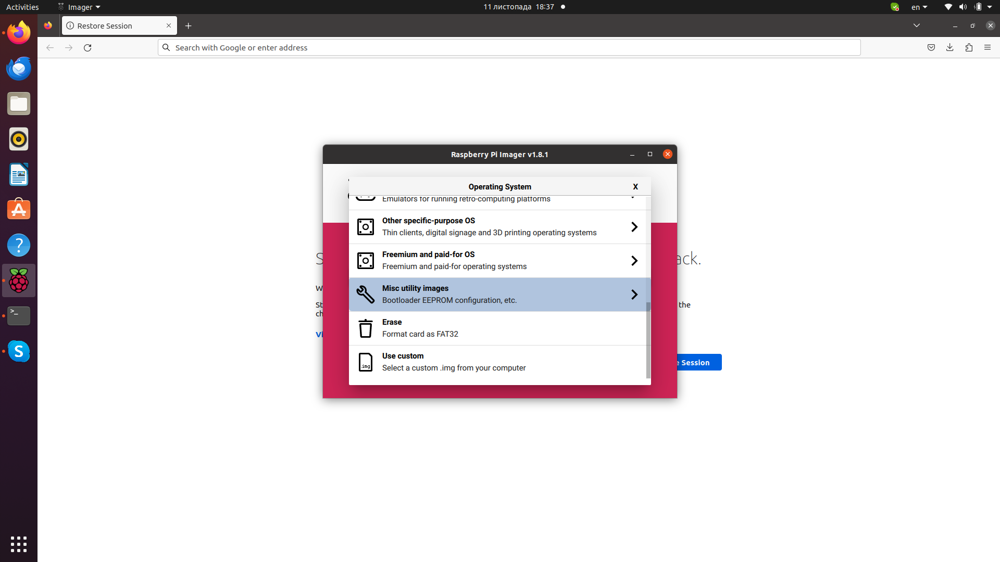
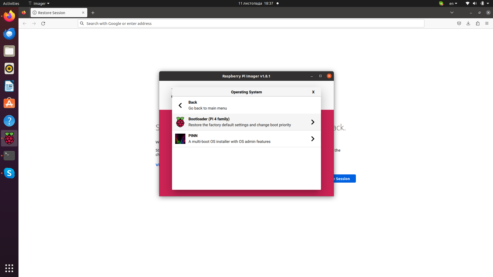
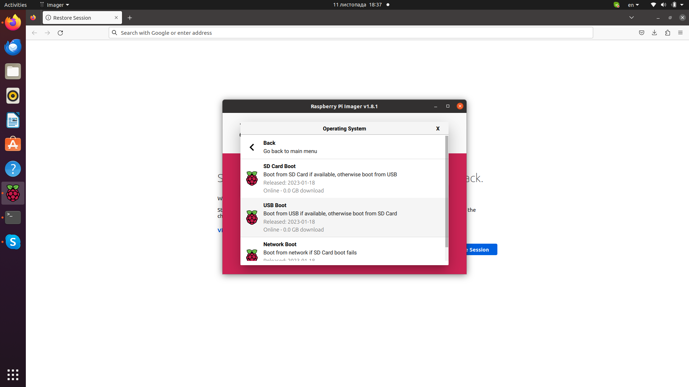
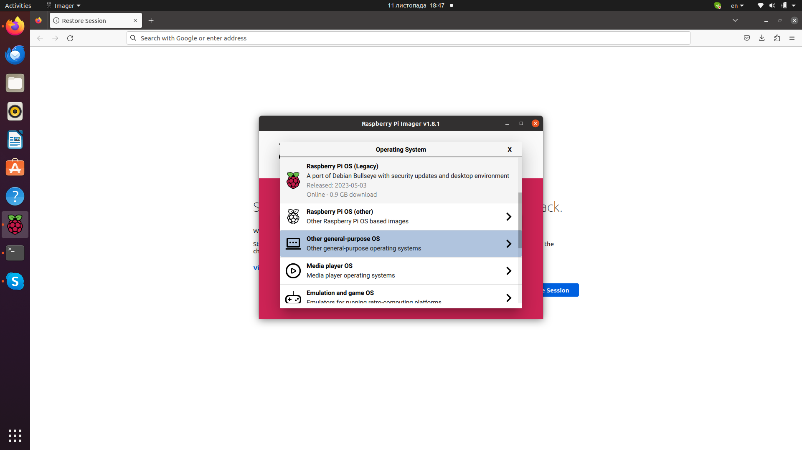
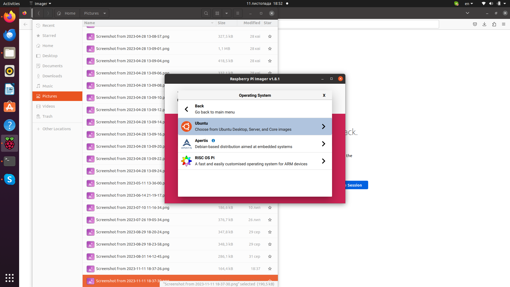
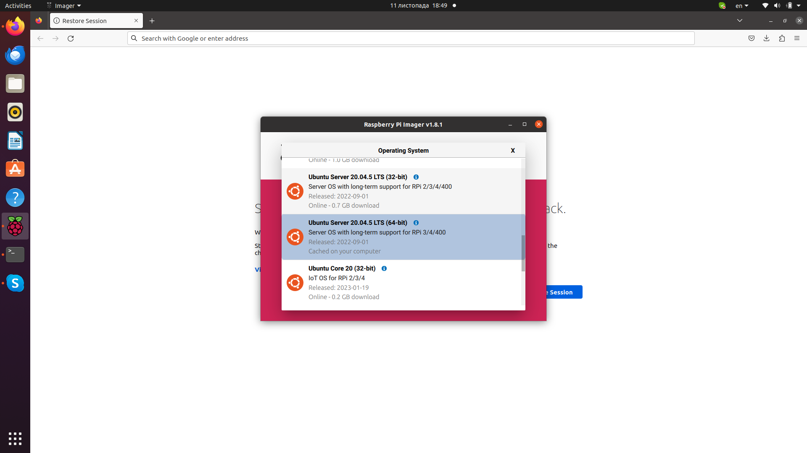

# Install Packages and libraries into Dest OS
(Like example for development purposes could be used VM with ubuntu20)

Used ROS Noetic 
## Prepare RPI ##
We use SSD drive. So we must connect SSD via USB and change bootloader

1. Let's fix bootloader
   * Run RPI-Imager
   * Chose your device
   * Chose Misc->Bootloader (Pi 4 family) -> USB Boot and flash it to usb drive
      - 
      - 
      - 
   * Insert SD card to RPI. Power it and wait 2-3 minutes until flash process will be finished. Than remove sd card.
2. Flash your ssd drive 
   * Run RPI-imager
   * Chose your device
   * Chose Other general-purpose OS -> Ubuntu -> Ubuntu Server 20.04.5 LTS (64-bit)
      - 
      - 
      - 
   * After flashing complete reattach ssd drive (Remove from usb port and attach back to your system[Not to rpi])
3. Run script
   ```shell
     ./install_rpi/install.sh
   ```
   * IF you want to change wifi settings -> edit file network-config and change ip, ssid and password
   * Default user/pass ubuntu
   * On first launch system will load almost 2-3 minutes. Than restart it
   * After login using default login and password. System will ask you to change default password. Change to any temporary
   * Re login back with temporary password and change it back to ubuntu by using command
```shell
sudo passwd ubuntu
```

## Install ROS Noetic ##
[Official documentation](http://wiki.ros.org/noetic/Installation/Ubuntu)

### 1. Configure your Ubuntu repositories

Configure your Ubuntu repositories to allow "restricted," "universe," and "multiverse." You can follow the Ubuntu guide for instructions on doing this.

Setup your sources.list

### 1.1 Setup your computer to accept software from packages.ros.org.
```shell
    sudo sh -c 'echo "deb http://packages.ros.org/ros/ubuntu $(lsb_release -sc) main" > /etc/apt/sources.list.d/ros-latest.list'
```

### 1.2 Set up your keys
```shell
    sudo apt install curl # if you haven't already installed curl
    curl -s https://raw.githubusercontent.com/ros/rosdistro/master/ros.asc | sudo apt-key add -
```

### 1.3 Installation
First, make sure your Debian package index is up-to-date:
```shell
    sudo apt update
```
ROS-Base: (Bare Bones) ROS packaging, build, and communication libraries. No GUI tools.
```shell
    sudo apt install ros-noetic-ros-base
```

### 1.4 Environment setup
You must source this script in every bash terminal you use ROS in.
```shell
  source /opt/ros/noetic/setup.bash
```
If you have more than one ROS distribution installed, ~/.bashrc must only source the setup.bash for the version you are currently using.
```shell
  echo "source /opt/ros/noetic/setup.bash" >> ~/.bashrc
  source ~/.bashrc
```

### 1.5 Dependencies for building packages
```shell
  sudo apt install python3-rosdep python3-rosinstall python3-rosinstall-generator python3-wstool build-essential
```
Before you can use many ROS tools, you will need to initialize rosdep. rosdep enables you to easily install system dependencies for source you want to compile and is required to run some core components in ROS. If you have not yet installed rosdep, do so as follows.
```shell
  sudo apt install python3-rosdep
```
With the following, you can initialize rosdep.
```shell
  sudo rosdep init
  rosdep update
```
2. Test

# Deploy our application
1. ssh keys must be generated before. Default read-only key installed by default. Password for key: ubuntu
2. Clone default source code
```shell
eval $(ssh-agent -s)
ssh-add ~/rpi
git clone git@bitbucket.org:Lex_vyshnevskyy/ros.git
```
3. To pull new source code use
   * Run ssh agent if it was not launched before in your working window
   ```shell
   eval $(ssh-agent -s)
   ssh-add ~/rpi
   ```
   * move to project directory
   ```shell
   cd ~/ros
   ```
   * Pull updates 
   ```shell
   git pull
   ```